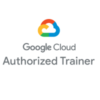
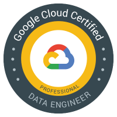

# Google Cloud Platform Learning Path

## 1. 인프라 현대화

    - Google Cloud Fundamentals: Core Infrastructure
    - Architecting with Google Compute Engine

## 2. 애플리케이션 현대화

    - Developing Applications with Google Cloud Platform
    - Application Development with Cloud Run
    - Logging, Monitoring and Observability in Google Cloud

## 3. 하이브리드 및 멀티 클라우드

    - Architecting with Google Kubernetes Engine
    - Architecting Hybrid Cloud Infrastructure with Anthos

## 4. 스마트 분석 및 데이터 분석 (Data engineering and analytics)

#### 4.1 Data Analyst Learning Path

    - From Data to Insights with Google Cloud Platform(1)
    - Big Data & Machine Learning Fundamentals(2)
    - Analyzing and Visualizing Data in Looker(3)
    - Developing Data Models with LookML(4)

#### 4.2 Data Engineer Learning Path

    - Data Engineering on Google Cloud
    - Serverless Data Processing with Dataflow

#### 4.3 Database Engineer Learning Path

    - Developing Applications on Google Cloud
    - Enterprise Database Migration
    - Migrating MySQL data to Cloud SQL using Database Migration Service

## 5. Apigee 및 비즈니스 애플리케이션 플랫폼

    - Developing APIs with Google Cloud's Apigee API Platform

## 6. 네트워킹 및 보안

    - Networking in Google Cloud

## 7. 머신러닝 및 인공지능

    - Google Cloud Big Data & Machine Learning Fundamentals
    - Machine Learning on Google Cloud
    - Advanced Machine Learning with TensorFlow on Google Cloud Platform
    - MLOps (Machine Learning Operations) Fundamentals
    - ML Pipelines on Google Cloud

## 8. 비즈니스를 위한 Google Cloud

    - Introduction to Digital Transformation with Google Cloud
    - Innovating with Data and Google Cloud
    - Infrastructure and Application Modernization with Google Cloud
    - Understanding Google Cloud Security and Operations

## 9. 생산성 및 공동작업

---

---

  
Architecting Hybrid Infrastructure with Anthos
Getting Started with Google Kubernetes Engine
Google Cloud Fundamentals for AWS Professionals
Google Cloud Fundamentals for Azure Professionals
Achieving Advanced Insights with BigQuery   - [1.6]  
Analyzing and Visualizing Data in Looker  - [1.1]  
Application Development with Cloud Run  - [2.0]   
Applying Machine Learning to your Data with GCP   - [1.6]  
Architecting Hybrid Cloud Infrastructure with Anthos   - [2.0.1] 
Architecting with Google Cloud: Design and Process   - [2.0]  
Architecting with Google Compute Engine   - [2.2]  
Building conversational experiences with Dialogflow
Building Solutions with Apigee X   - [1.0]   
Creating New BigQuery Datasets and Visualizing Insights   - [1.6]  
Customer Experiences with Contact Center AI   - [1.1]    
Customer Experiences with Contact Center AI - Dialogflow CX   - [2.0]    
Customer Experiences with Contact Center AI - Dialogflow ES   - [2.0]     
Data Engineering on Google Cloud   - [2.5]    
Data Integration with Cloud Data Fusion   - [1.0]    
Data Warehousing with BigQuery: Storage Design, Query Optimization, and Administration (ILT)   - [1.0] 
Deploying and Managing Google Cloud VMware Engine   - [2.7]     
Deploying and Migrating to Google Cloud VMware Engine   - [1.5]     
Developing APIs with Google Cloud's Apigee API Platform   - [3.0.0]     
Developing Applications with Cloud Functions on Google Cloud   - [1.0]     
Developing Applications with Google Cloud   - [1.4]  
Developing Data Models with LookML   - [1.1]  
Enterprise Database Migration   - [1.0]  
Exploring ​and ​Preparing ​your ​Data with BigQuery   
From Data to Insights with Google Cloud Platform  - [1.6]    
G Suite - Work transformation    
GenAI Study Jam - Generative AI Explorer   - [1.0]  
Getting Started with FinOps on Google Cloud   - [1.1]    
Getting Started with Google Kubernetes Engine   - [2.0]    
Getting Started with Terraform for Google Cloud   - [1.0]    
Google Cloud Big Data & Machine Learning Fundamentals   - [2.1]     
Google Cloud Big Data and Machine Learning Fundamentals   - [3.0]   
Google Cloud Fundamentals for Researchers   - [1.0]  
Google Cloud Fundamentals: Core Infrastructure   - [5.1]  -   
Google Cloud Platform Big Data and Machine Learning Fundamentals   - [1.3]    
Google Cloud Platform Fundamentals for AWS Professionals   - [2]    
Google Workspace - Work Transformation   - [1.1]  
Hybrid Infrastructure with Anthos for Partners   - [1.74]    
Installing and Managing Google Cloud's Apigee API Platform for Private Cloud   - [2.0.0]  
Interactive Chat for Applications using Generative AI Studio  - [1.0] 
Introduction to AI and Machine Learning on Google Cloud   - [v.1.0]  
Introduction to Responsible AI in Practice   - [1.0]  
Introduction to Vertex Forecasting and Time Series in Practice   - [v.1.0]  
Launching into Machine Learning   - [2.0] 
Logging, Monitoring and Observability in Google Cloud   - [2.0]  
Looker Developer Deep Dive  - [1.0]  
Machine Learning on Google Cloud   - [3.5]     
Machine Learning with TensorFlow on Google Cloud  - [2.0]    
Managing a Data Mesh with Dataplex   - [1.0]    
Managing Google Cloud's Apigee API Platform for Hybrid Cloud   - [2.0]  
Marketing Analytics Solutions for Partners   - [1.2.2]   
Migrating Amazon Redshift Users to BigQuery   - [1.0]  -   
Migrating Snowflake Users to BigQuery   - [1.0]  -   
Migrating Teradata Users to BigQuery   - [1.0]  -   
Networking in Google Cloud   - [2.0]  
roi-anthos-dev   - [1.0]    
Security in Google Cloud   - [3.0] 
Serverless Data Processing with Dataflow (ILT)   - [1.0]  
Text Generation for Applications using Generative AI Studio   - [1.0]  
Understanding Cloud Spanner   - [1.0]  
Vertex AI Forecasting   - [1.0] 
Vertex AI Model Garden   - [1.0]     
VM Migration for Partners   - [1.60]    
